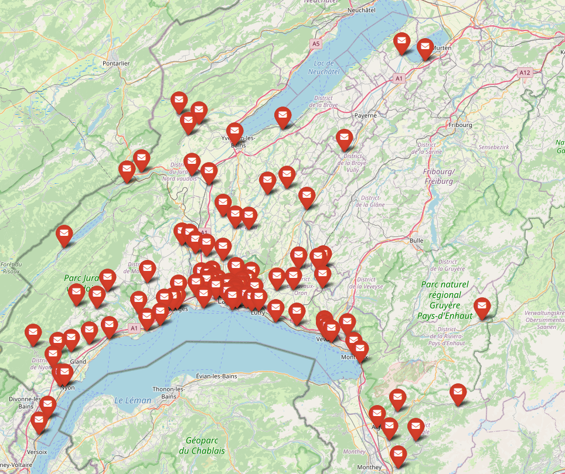

# Delivery Route Optimization Example: Vaud Post Office

This project showcases an example of optimizing delivery routes using the post offices in the Vaud region of Switzerland as a case study.

## Project Description

This Python-based solution aims to provide a method for calculating optimal delivery routes among various post offices in the Vaud region. Features include geospatial coordinate extraction, efficient delivery path determination, and route visualization.

### Starting and Ending Points

The starting (and ending) point for our delivery routes is:
**Poste CH SA - Base Distribution 1310 Daillens**.

### Work Distribution among Drivers

We will consider that we have \(N\) drivers available for deliveries. Our goal is to distribute the work such that each driver has an equal workload.

## Key Components

- **Data Collection**: Use the OSMnx library to collect post office locations in Vaud.
- **Route Determination**: Leverage the Project-OSRM API for accurate route calculation between locations.
- **Clustering & Optimization**: Implement KMeans clustering and the Hungarian method to achieve route optimization.
- **Visualization**: Employ the Folium library to create interactive maps visualizing the delivery routes.

## Features

- Extract post office locations using OSMnx.
- Calculate delivery routes using the Project-OSRM API.
- Create a cost matrix to determine delivery efficiencies.
- Cluster post offices based on location and delivery priority.
- Optimize routes to ensure shortest delivery times.
- Visualize the final delivery routes on an interactive map.

## Getting Started

**Prerequisites**: 
- Install the following Python libraries: osmnx, folium, osrm, shapely, requests, polyline, pandas, numpy, sklearn, scipy.

**Usage**:
1. Clone this repository: 
